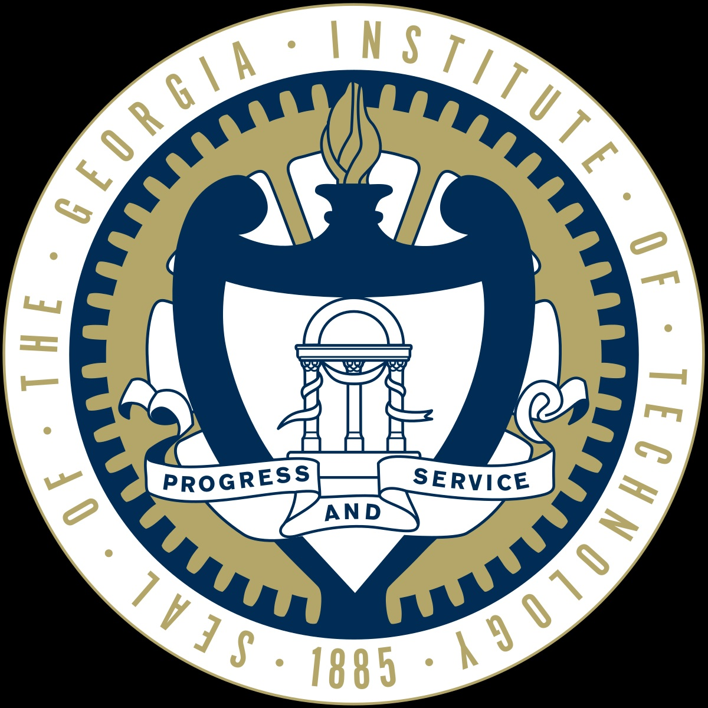

# I'm Ray! Nice to meet you 👋

## About Me

Welcome to my profile! Here's where I work on my passion projects. I'm a software developer who's interested in fintech, climate action, artificial intelligence, and animation. In my life, I want to use technology to inspire people and change the world. 

**Education:**
| | | | |
|:--:|:--:|:--:|:--:|
| </img> | [Columbia University](https://www.columbia.edu/) | B.A. in Computer Science, Business Management | 2021-2025 |
| </img> | [Georgia Institute of Technology](https://www.gatech.edu/) | M.S. in Computer Science, Machine Learning | 2025-Present |

**Projects:** 

Feel free to explore my GitHub repos to look at the projects I've been working on. Right now I'm working on three projects: algorithmic trading for cryptocurrencies, prompt-based spotify playlist generation, and climate model translation.

_"Everything around you that you call life was made up by people that were no smarter than you." - Steve Jobs_
